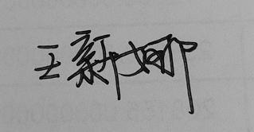
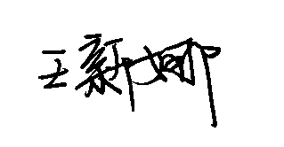
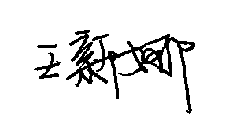
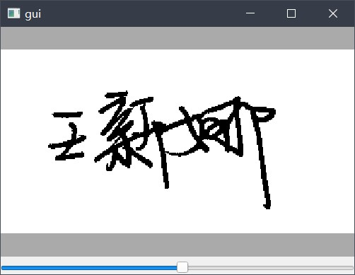

# image binaryzation tool

## Intention

To handle signature images like this(background: `grey or not pure`):

to this(background `white`):

or this(background `transparent`):

## Tools

1. `cli.py`

    + Usage:

        `cli.py [alpha] image-files`

        set parameter "aplha" = "alpha" if you want output files' white part being transparent.

        An convenient way is dragging image-files onto this script.

2. `gui.py`

    + Why:

    The `cli.py` can not change the threshold(set default: 100), if the result is not satisfying, you can use `gui.py`.

    + Usage:

        `gui.py [alpha]`

        set parameter `alpha` = "alpha" if you want output files' white part being transparent.

        A GUI interface is provided, drag image-files onto it and drag the slider to change the threshold of the image handler.

        Click on the image will show the origin image, in which way you can compare the result and the original.

        Press `Ctrl+S` to save the result.

## Interface

+ `gui.py`

